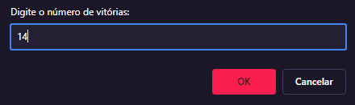
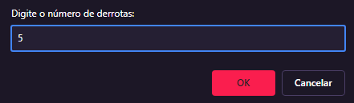
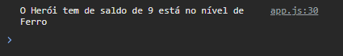
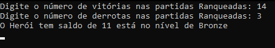

# 🎮 **Classificador de partidas ranqueadas**
## 📝 Objetivo
Criar uma função que recebe como parâmetro a quantidade de vitórias e derrotas de um jogador, depois disso retorne o resultado para uma variável.

```
Se vitórias for menor do que 10 = Ferro
Se vitórias for entre 11 e 20 = Bronze
Se vitórias for entre 21 e 50 = Prata
Se vitórias for entre 51 e 80 = Ouro
Se vitórias for entre 81 e 90 = Diamante
Se vitórias for entre 91 e 100= Lendário
Se vitórias for maior ou igual a 101 = Imortal
```
Ao final deve se exibir uma mensagem:
```
"O Herói tem de saldo de **{saldoVitorias}** está no nível de **{nivel}**"
```
## 💻 Desenvolvimento do desafio
Para desenvolver o projeto, utilizei da IDE [Visual Studio Code](https://code.visualstudio.com) e a linguagem **JavaScript** e **HTML** para interação com o navegador e utilização na função *prompt()*. Como alternativa e para fins de estudo, utilizei outra linguagem que possibilita uma interação com o usuário pelo terminal: **C#**.
> Em ambas as linguagens usei declarações de variáveis, funções e a estrutura de decisão if/else para determinar o nível do herói.

> Em C#, o usuário pode definir quantas vitórias e derrotas teve. 

>Utilizei o ChatGPT como auxiliar no desenvolvimento da adaptação do código JavaScript para C#.

## ✅ Exemplos de saída
**🟨 JavaScript (Executando no navegador usando o Live Server)**





**🟩 C# (Executando no terminal da IDE)**


## 
 | Desafio proposto pelo Felipão no Bootcamp de Desenvolvimento de Jogos com Godot da [DIO](https://www.dio.me)
